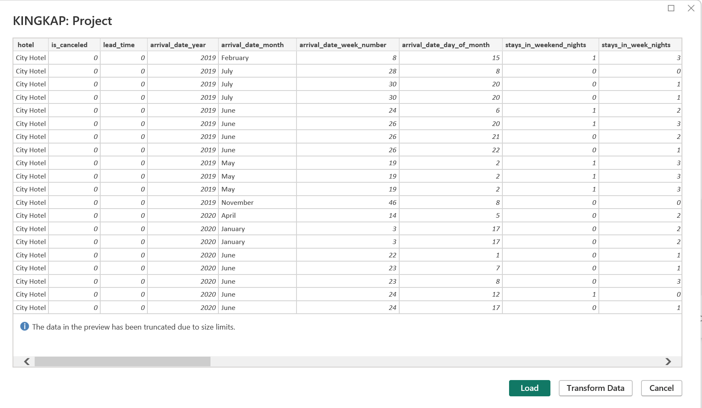

# _Hotel Revenue and Operational Efficiency Analysis_


---

## _Introduction_

Welcome to the **Hotel Revenue and Operational Efficiency Analysis** Project, an exploration into the intricacies of **Hotel Booking Data Analysis** and visualisation. 
The primary goal of this project is to develop a robust database and craft SQL queries for thorough analysis. By leveraging Power BI, the aim is to create compelling visualisations to address crucial business questions.

## _The hotel management is confronted with pivotal business inquiries that necessitate data-driven insights for informed decision-making. The primary challenges involve comprehending the growth trajectories of our hotel revenue, evaluating the sufficiency of our parking facilities, and discerning trends within the booking data. Hence, the following questions arise:_

1. _**Is our hotel revenue experiencing annual growth?**_
2. _**Should we consider expanding our parking lot to meet demand?**_
3. _**What discernible trends can be extracted from the booking data?**_

These questions directly impact strategic planning, resource allocation, and overall business performance. The successful resolution of these challenges is essential for optimising revenue streams, enhancing operational efficiency, and guiding decision-making to foster continuous improvement in our hotel business.

## _Skills / Concepts Demonstrated_

_The project seamlessly incorporated the following robust components:_
- Database Management
- SQL Querying
- Data Analysis and Exploratory Data Analysis (EDA)
- Power BI Integration and Visualisation
- Business Intelligence
- Trends Identification

## _1. Database Initialisation and Data Consolidation_
During the initial phase of the project, the focus was on uploading data into the project database and preparing data tables for subsequent SQL commands. Three distinct tables, denoted as '2018', '2019', and '2020', served as the repositories of data. To examine the contents of each table comprehensively, the following SQL commands were executed:
```
select * from dbo.['2018']
select * from dbo.['2019']
select * from dbo.['2020']
````

_**Import the Data in the Project Database**_               |    _**Display the Tables in Project Database**_          
:----------------------------------------------------:|:-------------------------------------------------------:
  | 

To amalgamate data from the three tables, the UNION operator is applied to the following commands:

```
SELECT * FROM dbo.['2018']
UNION
SELECT * FROM dbo.['2019']
UNION
SELECT * FROM dbo.['2020']
```
_**Union Tables**_
:-----------------------------:


## _2. Exploratory Data Analysis (EDA)_

In this phase, Exploratory Data Analysis (EDA) is employed to address specific queries related to business objectives. Key questions include:
-   _Is hotel revenue exhibiting annual growth?_
-   _Is there a need to expand parking facilities?_
-   _What discernible trends manifest within the dataset?_

Prior to addressing these questions, the initial step involves creating a consolidated temporary table named 'hotels.' This amalgamation of data from 2018, 2019, and 2020 is achieved through the following SQL code, facilitating streamlined access and comprehensive analysis.

```Creating a Temporary Table 'hotels'
WITH hotels AS (
    SELECT * FROM dbo.['2018$']
    UNION
    SELECT * FROM dbo.['2019$']
    UNION
    SELECT * FROM dbo.['2020$']
)
SELECT * FROM hotels;
```
The 'hotels' temporary table serves as a foundational element for subsequent analytical processes.

## _Q.1: Is our hotel revenue growing yearly?_

Upon assessing our dataset, it is observed that explicit revenue figures are not available. However, relevant data such as Average Daily Rate (ADR), stays in week nights, and stays in weekend nights are present. To address this, a new column named "revenue" will be introduced, derived from the combined data of these three aforementioned columns.

```
-- Creating a Temporary Table 'hotels' for Data Combination
WITH hotels AS (
    SELECT * FROM dbo.['2018$']
    UNION
    SELECT * FROM dbo.['2019$']
    UNION
    SELECT * FROM dbo.['2020$']
)
SELECT * FROM hotels;
SELECT 
    (stays_in_week_nights + stays_in_weekend_nights) * adr AS revenue
FROM hotels;
```

This process facilitates the derivation of revenue insights, a crucial step in understanding the yearly growth patterns in hotel revenue.

_**Revenue**_
:---------------------:


Incorporating an additional column, "arrival_date_year," from the dataset, the subsequent step involves computing the cumulative revenue. This calculation is executed by grouping the data based on the year.

```
WITH Hotels AS (
    SELECT * FROM [dbo].['2018']
    UNION
    SELECT * FROM [dbo].['2019']
    UNION
    SELECT * FROM [dbo].['2020']
)
SELECT
    arrival_date_year,
    ROUND(SUM((Stays_in_weekend_nights + stays_in_weekend_nights) * Adr), 2) AS Revenue
FROM Hotels
GROUP BY arrival_date_year
```
The ensuing table, visually represented , illustrates that the revenue exhibited an increment from 2018 to 2019, subsequently experiencing a decline in 2020.

_**Revenue Increase**_
:---------------------:


Determining the revenue trend by hotel type involves grouping the data by hotel and assessing which hotels have yielded the highest revenue. The SQL query below accomplishes this task, utilizing a temporary table named 'Hotels' that consolidates data from the years 2018, 2019, and 2020.

```
WITH Hotels AS (
    SELECT * FROM [dbo].['2018']
    UNION
    SELECT * FROM [dbo].['2019']
    UNION
    SELECT * FROM [dbo].['2020']
)
SELECT
    arrival_date_year,
    hotel,
    ROUND(SUM((Stays_in_weekend_nights + stays_in_weekend_nights) * Adr), 2) AS Revenue
FROM Hotels
GROUP BY arrival_date_year, hotel;
```

This visual representation illustrates the nuanced revenue trends discerned through meticulous grouping and analysis by hotel type.
_Revenue Trend by Hotel Type_
:--------------------------------------:


## _Q.2: Should we increase our parking lot size?_

To address the inquiry regarding the expansion of our parking facilities, a focused analysis on car parking spaces and the number of residing guests is conducted. This is accomplished through the implementation of the subsequent SQL query.

```
WITH Hotels AS (
    SELECT * FROM [dbo].['2018']
    UNION
    SELECT * FROM [dbo].['2019']
    UNION
    SELECT * FROM [dbo].['2020']
)
SELECT
    arrival_date_year, hotel,
    SUM((stays_in_week_nights + stays_in_weekend_nights) * adr) AS revenue,
    CONCAT (ROUND((SUM(required_car_parking_spaces) / SUM(stays_in_week_nights + stays_in_weekend_nights)) * 100, 2), '%') AS parking_percentage
FROM Hotels
GROUP BY arrival_date_year, hotel;
```

In the subsequent table, visual evidence indicates that our current parking space allocation is deemed sufficient. Consequently, there exists no immediate necessity for an augmentation of our parking lot size.

_**Space for Parking**_
:-------------------------:


 _3. Generate Data Visualisations Using Power BI_

Prior to transitioning to Power BI, a preliminary data preprocessing step is imperative. Leveraging SQL, two left join queries are executed on the dataset.

First Left Join: This operation amalgamates the 'hotels' table with the 'market_segment' table by aligning the 'market_segment' column in the 'hotels' table with the 'market_segment.market_segment' column.

Second Left Join: The 'hotels' table is fused with the 'meal_cost' table by correlating the 'meal' column in the 'hotels' table with the 'meal_cost.meal' column.

```
-- Combine data for years 2018, 2019, and 2020
SELECT * FROM [dbo].['2018']
UNION
SELECT * FROM [dbo].['2019']
UNION
SELECT * FROM [dbo].['2020']
)
SELECT *
FROM Hotels
LEFT JOIN dbo.market_segments ON Hotels.market_segment = market_segments.market_segment
LEFT JOIN dbo.meal_cost ON meal_cost.meal = Hotels.meal;
```

Subsequently, we establish a connection between Power BI and the SQL Server database by entering the server and database names in the "SQL Server Database" window. For the Advanced options, we incorporate our optimized query.

```
-- Combine data for years 2018, 2019, and 2020
SELECT * FROM [dbo].['2018']
UNION
SELECT * FROM [dbo].['2019']
UNION
SELECT * FROM [dbo].['2020']
)
SELECT *
FROM Hotels
LEFT JOIN dbo.market_segments ON Hotels.market_segment = market_segments.market_segment
LEFT JOIN dbo.meal_cost ON meal_cost.meal = Hotels.meal;
```

_Connecting Power BI to SQL Server_                     |   _Display of Data in Power BI_
:---------------------------------------------------: | :----------------------------------:
         |   


## _Q.3: What trends can we see in the data?_

Examining the data reveals notable trends, visually presented through Power BI. Several observations stand out:

- The revenue demonstrated an upward trajectory between 2018 and 2019, followed by a decline from 2019 to 2020.
- The Average Daily Rate (ADR) experienced a positive shift, ascending from $99.53 in 2019 to $104.47 in 2020.
- The aggregate number of nights booked by patrons exhibited a decrease from 2019 to 2020.
- The hotel's discount percentage witnessed an augmentation from 2019 to 2020, a strategic move to allure a greater customer base.

 Data Visualization in Power BI (Trends)
:---------------------------------------------------:
.jpg)


## _Conclusion_

In the culmination of the Hotel Revenue and Operational Efficiency Analysis project, a comprehensive exploration of hotel booking data has been undertaken, addressing key business questions and offering data-driven insights. The project seamlessly integrated various components, including database management, SQL querying, exploratory data analysis (EDA), Power BI integration, and visualization, demonstrating a holistic approach to deriving meaningful conclusions.

## _Key Findings:_

## _1. Yearly Revenue Trends:_
The analysis revealed an increase in revenue from 2018 to 2019, followed by a decline in 2020. This nuanced understanding of yearly revenue patterns is essential for strategic planning.

## _2. Parking Facilities Evaluation:_
Through a focused analysis on parking spaces and guest numbers, we determined that our current parking space allocation is sufficient, eliminating the immediate need for an expansion.

## _3. Data Trends Visualization:_
Utilizing Power BI, we visually presented trends such as the upward trajectory of Average Daily Rate (ADR), a decline in total nights booked, and strategic shifts in discount percentages. These visualizations aid in understanding overall business dynamics.

In essence, this project serves as a foundation for leveraging data-driven insights to enhance the overall performance of our hotel business. The integration of database management, SQL querying, exploratory data analysis, and Power BI visualization provides a robust framework for ongoing analysis and strategic decision-making.
